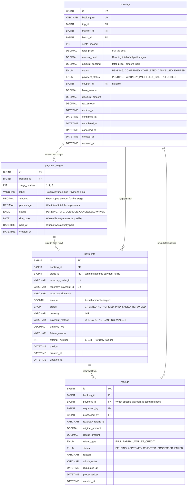

# Tourly/Roamaya — Final Database Architecture

> Top-level normalized design with staged payments, proper money flow, and all known issues resolved.

---

## Part 1: Complete Issue List (Current → Fixed)

### CRITICAL (Will break production)

| # | Issue | Current State | Fix |
|---|-------|---------------|-----|
| 1 | Payment is OneToOne with Booking | Can only store 1 payment per booking | Change to ManyToOne — one booking has MULTIPLE payments (one per stage) |
| 2 | `TripMedia.url` entity says 500, DDL says 1000 | Hibernate validate will reject or truncate | Update entity annotation to `length = 1000` |
| 3 | No link between Payment and PaymentStage is enforced | A payment can exist without a stage, or reference a stage from another booking | Add CHECK constraint: payment.stage_id must belong to same booking |
| 4 | `trip_batches` allows duplicate date ranges | Can insert 2 batches with same dates for same trip | Add UNIQUE(trip_id, start_date, end_date) |

### HIGH (Data integrity / normalization violations)

| # | Issue | Current State | Fix |
|---|-------|---------------|-----|
| 5 | Duplicate inclusions model | `trip_items` (trip-level) AND `trip_inclusions` (batch-level) both exist | Remove `trip_inclusions` — keep only `trip_items` at trip level |
| 6 | `User` timestamps split into date + time columns | `created_date` + `created_time` as separate columns | Migrate to single `created_at DATETIME` |
| 7 | `Trip.badges` stored as JSON string in TEXT column | `"[\"Adventure\",\"Weekend\"]"` — not queryable | Normalize to `trip_badges(trip_id, badge_name)` table |
| 8 | `UserProfile.socialLinks` comma-separated string | Can't query, validate, or index individual links | Use JSON type or normalize to `user_social_links` table |
| 9 | `UserProfile.preferredDestinations` comma-separated | Same 1NF violation | Use JSON type or normalize |
| 10 | No ON DELETE CASCADE on V4 child tables | `trip_batches`, `trip_itinerary_days` won't cascade on direct SQL delete | Add CASCADE via migration |
| 11 | `HostVerification` uses enum from `trip.enums` package | Cross-domain coupling | Move to shared `common.enums.VerificationStatus` |
| 12 | `Review.targetId` polymorphic with no referential integrity | Can point to non-existent entities | Accept tradeoff but add app-level validation + periodic cleanup |
| 13 | `Booking` has no `@PrePersist` for timestamps | `createdAt`/`updatedAt` set externally or NULL | Add lifecycle hooks like other entities |

### MEDIUM (Design debt)

| # | Issue | Current State | Fix |
|---|-------|---------------|-----|
| 14 | No audit on seat decrements | `booked_seats` changes with no trace | Log in audit_logs or add `seat_reservations` table |
| 15 | No DB-level booking expiry fallback | Only app scheduler expires stale bookings | Add MySQL EVENT as safety net |
| 16 | `WebhookLog.payload` mapped as String not JSON | Loses MySQL JSON query capability | Use `@JdbcTypeCode(SqlTypes.JSON)` or keep as-is (acceptable) |
| 17 | Inconsistent timestamp handling across entities | Mix of `@PrePersist`, inline defaults, and nothing | Standardize: all entities use `@PrePersist`/`@PreUpdate` |
| 18 | `Payment` has refund fields directly on it | `razorpay_refund_id`, `refund_amount` on Payment entity | Remove — refunds already have their own `refunds` table |
| 19 | `Booking.paymentStatus` can drift from actual payments | Denormalized status that must be manually synced | Accept for query performance but add sync check in payment service |
| 20 | No `coupon_id` on bookings | Can't easily see which coupon was applied to a booking | Either add `coupon_id` FK on bookings OR rely on `coupon_usages` join |

---

## Part 2: Staged Payment Architecture

### The Business Flow

```
Traveler books a trip (₹30,000)
    │
    ├── Stage 1: Token/Advance (30%) → ₹9,000  → Due immediately
    ├── Stage 2: Mid-payment (40%)   → ₹12,000 → Due 15 days before trip
    └── Stage 3: Final (30%)         → ₹9,000  → Due 3 days before trip
```

### How It Works in the Database

```
BOOKING (id=1, trip_id=5, traveler_id=30, total_price=30000, status=CONFIRMED)
    │
    ├── PAYMENT_STAGE (id=1, booking_id=1, stage_number=1, label="Token Advance",
    │       amount=9000, percentage=30.00, status=PAID, due_date=2026-06-01, paid_at=...)
    │       │
    │       └── PAYMENT (id=1, booking_id=1, stage_id=1, amount=9000, 
    │               status=PAID, razorpay_order_id=order_xxx, razorpay_payment_id=pay_xxx)
    │
    ├── PAYMENT_STAGE (id=2, booking_id=1, stage_number=2, label="Mid Payment",
    │       amount=12000, percentage=40.00, status=PENDING, due_date=2026-06-25)
    │       │
    │       └── (No payment yet — traveler hasn't paid this stage)
    │
    └── PAYMENT_STAGE (id=3, booking_id=1, stage_number=3, label="Final Payment",
            amount=9000, percentage=30.00, status=PENDING, due_date=2026-07-07)
            │
            └── (No payment yet)
```

### Table Design for Staged Payments



---

## Part 3: Traveler Payment Flow (Step by Step)

### Scenario: Traveler books a 3-stage trip

```
┌─────────────────────────────────────────────────────────────────────┐
│ STEP 1: Traveler clicks "Book Now"                                   │
├─────────────────────────────────────────────────────────────────────┤
│                                                                       │
│  Backend creates:                                                     │
│  ┌─────────────────────────────────────────────────┐                │
│  │ BOOKING                                          │                │
│  │   status = PENDING                               │                │
│  │   payment_status = PENDING                       │                │
│  │   total_price = 30000                            │                │
│  │   amount_paid = 0                                │                │
│  │   expires_at = now + 30 minutes                  │                │
│  └─────────────────────────────────────────────────┘                │
│                                                                       │
│  Backend creates 3 payment stages:                                    │
│  ┌──────────────────────────────────────────────────────────┐       │
│  │ STAGE 1: amount=9000,  due=NOW,         status=PENDING   │       │
│  │ STAGE 2: amount=12000, due=trip-15days, status=PENDING   │       │
│  │ STAGE 3: amount=9000,  due=trip-3days,  status=PENDING   │       │
│  └──────────────────────────────────────────────────────────┘       │
│                                                                       │
│  Backend uses PESSIMISTIC_WRITE lock to reserve seats                │
│  trips.booked_seats += seats_booked                                  │
│                                                                       │
└─────────────────────────────────────────────────────────────────────┘

┌─────────────────────────────────────────────────────────────────────┐
│ STEP 2: Pay Stage 1 (Token)                                          │
├─────────────────────────────────────────────────────────────────────┤
│                                                                       │
│  Frontend calls: POST /api/payments/create-order                     │
│    { booking_id: 1, stage_id: 1 }                                    │
│                                                                       │
│  Backend:                                                             │
│    1. Validates stage belongs to booking                              │
│    2. Validates stage status = PENDING                                │
│    3. Calls Razorpay → creates order for ₹9000                      │
│    4. Creates PAYMENT record:                                         │
│       ┌─────────────────────────────────────────┐                   │
│       │ booking_id = 1                           │                   │
│       │ stage_id = 1                             │                   │
│       │ razorpay_order_id = order_abc123         │                   │
│       │ amount = 9000                            │                   │
│       │ status = CREATED                         │                   │
│       │ attempt_number = 1                       │                   │
│       └─────────────────────────────────────────┘                   │
│    5. Returns order_id to frontend                                    │
│                                                                       │
│  Frontend opens Razorpay checkout → traveler pays                    │
│                                                                       │
└─────────────────────────────────────────────────────────────────────┘

┌─────────────────────────────────────────────────────────────────────┐
│ STEP 3: Payment Verification (Webhook or Frontend callback)          │
├─────────────────────────────────────────────────────────────────────┤
│                                                                       │
│  Frontend calls: POST /api/payments/verify                           │
│    { razorpay_order_id, razorpay_payment_id, razorpay_signature }   │
│                                                                       │
│  Backend:                                                             │
│    1. Verify signature (HMAC SHA256)                                 │
│    2. Update PAYMENT: status = PAID, paid_at = now                   │
│    3. Update PAYMENT_STAGE: status = PAID, paid_at = now             │
│    4. Update BOOKING:                                                 │
│         amount_paid += 9000                                           │
│         amount_pending = 21000                                        │
│         payment_status = PARTIALLY_PAID                               │
│         status = CONFIRMED (first stage paid = confirmed)            │
│    5. Create COMMISSION record (platform earnings on this stage)      │
│    6. Send notification to traveler + host                            │
│    7. Log in audit_logs                                               │
│                                                                       │
└─────────────────────────────────────────────────────────────────────┘

┌─────────────────────────────────────────────────────────────────────┐
│ STEP 4: Stage 2 becomes due (15 days before trip)                    │
├─────────────────────────────────────────────────────────────────────┤
│                                                                       │
│  Scheduler checks daily:                                              │
│    - Find stages where due_date <= today AND status = PENDING        │
│    - Send reminder notification to traveler                           │
│    - If due_date + 3 days passed → mark as OVERDUE                   │
│    - If OVERDUE + 7 days → auto-cancel booking, release seats        │
│                                                                       │
│  Traveler pays Stage 2 → same flow as Step 2/3                       │
│    amount_paid = 21000, amount_pending = 9000                         │
│    payment_status remains PARTIALLY_PAID                              │
│                                                                       │
└─────────────────────────────────────────────────────────────────────┘

┌─────────────────────────────────────────────────────────────────────┐
│ STEP 5: Stage 3 paid → Fully Paid                                    │
├─────────────────────────────────────────────────────────────────────┤
│                                                                       │
│  After final stage payment verified:                                  │
│    BOOKING:                                                           │
│      amount_paid = 30000                                              │
│      amount_pending = 0                                               │
│      payment_status = FULLY_PAID                                      │
│                                                                       │
│  Now eligible for:                                                    │
│    - Host/Planner payout processing                                   │
│    - Full trip access                                                 │
│                                                                       │
└─────────────────────────────────────────────────────────────────────┘

┌─────────────────────────────────────────────────────────────────────┐
│ STEP 6: Trip completes → Payouts                                     │
├─────────────────────────────────────────────────────────────────────┤
│                                                                       │
│  After trip end_date passes:                                          │
│    1. Booking status → COMPLETED                                      │
│    2. Commission finalized (status = REALIZED)                        │
│    3. Payout created for HOST:                                        │
│         gross = their share                                           │
│         commission_deducted = platform cut                            │
│         tds_deducted = tax                                            │
│         net_amount = what they receive                                │
│    4. Payout created for PLANNER (if different from host)             │
│    5. Payouts processed via Razorpay Route/Transfer                  │
│                                                                       │
└─────────────────────────────────────────────────────────────────────┘
```

### What happens on FAILURE?

```
Payment fails at Razorpay:
  - PAYMENT record: status = FAILED, failure_reason = "insufficient_funds"
  - PAYMENT_STAGE: stays PENDING (not failed — stage can be retried)
  - Create new PAYMENT with attempt_number = 2
  - Traveler can retry immediately

Traveler doesn't pay Stage 2 within grace period:
  - PAYMENT_STAGE: status = OVERDUE
  - After 7 days overdue:
    - BOOKING: status = CANCELLED, cancellation_reason = "Payment overdue"
    - Release seats: trips.booked_seats -= seats_booked
    - Refund Stage 1 payment (partial refund per cancellation policy)
    - Create REFUND record linked to the Stage 1 payment
```

---

## Part 4: Complete Normalized ER Diagram

```mermaid
erDiagram

    %% ═══════════════════════════════════════════
    %% AUTH DOMAIN (4 tables)
    %% ═══════════════════════════════════════════

    roles {
        BIGINT id PK
        ENUM name UK "TRAVELER, PLANNER, HOST, ADMIN"
        VARCHAR description
        BOOLEAN is_active
        DATETIME created_at
        DATETIME updated_at
    }

    permissions {
        BIGINT id PK
        ENUM permission_name UK
        VARCHAR description
    }

    role_permissions {
        BIGINT id PK
        BIGINT role_id FK
        BIGINT permission_id FK
        UNIQUE role_id_permission_id
    }

    users {
        BIGINT id PK
        VARCHAR full_name
        VARCHAR email UK
        VARCHAR phone UK
        VARCHAR password "nullable for Google users"
        VARCHAR google_id UK
        VARCHAR avatar
        VARCHAR aadhaar_number UK
        VARCHAR pan_number UK
        VARCHAR instagram_username
        VARCHAR website_url
        BIGINT role_id FK
        ENUM account_status "ACTIVE, SUSPENDED, BANNED"
        BOOLEAN email_verified
        BOOLEAN phone_verified
        BOOLEAN kyc_verified
        BOOLEAN admin_approved
        DATETIME last_login_at
        DATETIME created_at
        DATETIME updated_at
        DATETIME deleted_at "soft delete"
    }

    user_profiles {
        BIGINT id PK
        BIGINT user_id FK_UK "OneToOne"
        VARCHAR display_name
        TEXT bio
        VARCHAR profile_picture_url
        VARCHAR contact_email
        VARCHAR contact_phone
        JSON social_links
        VARCHAR preferred_language
        VARCHAR timezone
        JSON preferred_destinations
        JSON travel_styles
        BOOLEAN newsletter_subscribed
        DATETIME created_at
        DATETIME updated_at
    }

    roles ||--o{ users : "assigns"
    roles ||--o{ role_permissions : "grants"
    permissions ||--o{ role_permissions : "via"
    users ||--o| user_profiles : "has"

    %% ═══════════════════════════════════════════
    %% TRIP DOMAIN (12 tables)
    %% ═══════════════════════════════════════════

    destinations {
        BIGINT id PK
        VARCHAR country
        VARCHAR state
        VARCHAR city
        DOUBLE latitude
        DOUBLE longitude
        VARCHAR image_url
        TEXT description
        BOOLEAN is_active
        UNIQUE country_state_city
    }

    trips {
        BIGINT id PK
        VARCHAR title
        TEXT description
        BIGINT planner_id FK "Who designed the trip"
        BIGINT host_id FK "Who hosts on-ground (nullable, defaults to planner)"
        BIGINT destination_id FK
        DATE start_date
        DATE end_date
        DECIMAL base_price "12,2"
        DECIMAL min_price
        DECIMAL max_price
        DECIMAL current_price "Dynamic — recalculated"
        DECIMAL max_discount_percent "5,2"
        DECIMAL max_increase_percent "5,2"
        INT total_seats
        INT booked_seats
        ENUM category "ADVENTURE, LUXURY, HERITAGE, BACKPACKING, WEEKEND"
        ENUM status "DRAFT, PUBLISHED, COMPLETED, CANCELLED"
        ENUM approval_status "PENDING, APPROVED, REJECTED"
        ENUM cancellation_policy "FLEXIBLE, MODERATE, STRICT"
        VARCHAR rejection_reason
        VARCHAR difficulty
        VARCHAR group_size_label
        VARCHAR trip_type
        VARCHAR best_time
        VARCHAR starts_from
        VARCHAR ends_at
        TEXT about_description
        INT min_group_size
        INT duration_days
        INT duration_nights
        BOOLEAN is_active
        BOOLEAN is_deleted
        DATETIME created_at
        DATETIME updated_at
        DATETIME deleted_at
    }

    trip_batches {
        BIGINT id PK
        BIGINT trip_id FK
        DATE start_date
        DATE end_date
        DECIMAL price "12,2"
        INT seats_available
        ENUM status "OPEN, FULL, CANCELLED"
        DATETIME created_at
        UNIQUE trip_id_start_end
    }

    trip_itinerary_days {
        BIGINT id PK
        BIGINT trip_id FK
        INT day_number
        VARCHAR title
        TEXT description
        VARCHAR stay
        VARCHAR meals
        INT sort_order
    }

    trip_highlights {
        BIGINT id PK
        BIGINT trip_id FK
        VARCHAR icon
        VARCHAR title
        INT sort_order
    }

    trip_stops {
        BIGINT id PK
        BIGINT trip_id FK
        VARCHAR stop_name
        INT sort_order
    }

    trip_items {
        BIGINT id PK
        BIGINT trip_id FK
        ENUM type "INCLUSION, EXCLUSION"
        VARCHAR description
        INT sort_order
    }

    trip_media {
        BIGINT id PK
        BIGINT trip_id FK
        ENUM media_type "IMAGE, VIDEO"
        VARCHAR url "length=1000"
        VARCHAR caption
        BOOLEAN is_cover
        INT sort_order
    }

    trip_price_breakdown {
        BIGINT id PK
        BIGINT trip_id FK
        VARCHAR category
        DECIMAL amount "12,2"
        VARCHAR description
        INT sort_order
    }

    trip_stays {
        BIGINT id PK
        BIGINT trip_id FK
        VARCHAR name
        VARCHAR location
        TEXT description
        INT sort_order
    }

    trip_stay_amenities {
        BIGINT id PK
        BIGINT stay_id FK
        VARCHAR amenity
    }

    trip_stay_images {
        BIGINT id PK
        BIGINT stay_id FK
        VARCHAR image_url "length=1000"
        INT sort_order
    }

    trip_badges {
        BIGINT id PK
        BIGINT trip_id FK
        VARCHAR badge_name
        UNIQUE trip_id_badge_name
    }

    users ||--o{ trips : "plans"
    users ||--o{ trips : "hosts"
    destinations ||--o{ trips : "at"
    trips ||--o{ trip_batches : "scheduled as"
    trips ||--o{ trip_itinerary_days : "day by day"
    trips ||--o{ trip_highlights : "featured"
    trips ||--o{ trip_stops : "route"
    trips ||--o{ trip_items : "includes/excludes"
    trips ||--o{ trip_media : "gallery"
    trips ||--o{ trip_price_breakdown : "cost split"
    trips ||--o{ trip_stays : "accommodations"
    trips ||--o{ trip_badges : "tagged"
    trip_stays ||--o{ trip_stay_amenities : "offers"
    trip_stays ||--o{ trip_stay_images : "photos"

    %% ═══════════════════════════════════════════
    %% BOOKING DOMAIN (1 table)
    %% ═══════════════════════════════════════════

    bookings {
        BIGINT id PK
        VARCHAR booking_ref UK "BK-YYYYMMDD-XXXXXX"
        BIGINT trip_id FK
        BIGINT traveler_id FK
        BIGINT batch_id FK "nullable"
        BIGINT coupon_id FK "nullable"
        INT seats_booked
        DECIMAL base_amount "12,2"
        DECIMAL discount_amount "12,2"
        DECIMAL tax_amount "12,2"
        DECIMAL total_price "12,2 — final amount owed"
        DECIMAL amount_paid "12,2 — sum of completed stage payments"
        DECIMAL amount_pending "12,2 — total_price - amount_paid"
        ENUM status "PENDING, CONFIRMED, COMPLETED, CANCELLED, EXPIRED"
        ENUM payment_status "PENDING, PARTIALLY_PAID, FULLY_PAID, REFUNDED"
        VARCHAR cancellation_reason
        DATETIME expires_at "Auto-cancel if stage 1 not paid"
        DATETIME confirmed_at
        DATETIME completed_at
        DATETIME cancelled_at
        DATETIME created_at
        DATETIME updated_at
    }

    trips ||--o{ bookings : "booked"
    users ||--o{ bookings : "traveler"
    trip_batches ||--o{ bookings : "for batch"
    coupons ||--o{ bookings : "applied coupon"

    %% ═══════════════════════════════════════════
    %% PAYMENT DOMAIN (6 tables)
    %% ═══════════════════════════════════════════

    payment_stages {
        BIGINT id PK
        BIGINT booking_id FK
        INT stage_number "Sequential: 1, 2, 3"
        VARCHAR label "Token Advance, Mid Payment, Final"
        DECIMAL amount "12,2 — exact amount for this stage"
        DECIMAL percentage "5,2 — what % of total"
        ENUM status "PENDING, PAID, OVERDUE, CANCELLED, WAIVED"
        DATE due_date
        DATETIME paid_at
        DATETIME created_at
        UNIQUE booking_id_stage_number
    }

    payments {
        BIGINT id PK
        BIGINT booking_id FK
        BIGINT stage_id FK
        VARCHAR razorpay_order_id UK
        VARCHAR razorpay_payment_id UK
        VARCHAR razorpay_signature
        DECIMAL amount "12,2"
        ENUM status "CREATED, AUTHORIZED, PAID, FAILED, REFUNDED"
        VARCHAR currency "INR"
        VARCHAR payment_method "UPI, CARD, NETBANKING, WALLET"
        DECIMAL gateway_fee "10,2"
        VARCHAR failure_reason
        INT attempt_number "Retry count for same stage"
        DATETIME paid_at
        DATETIME created_at
        DATETIME updated_at
    }

    refunds {
        BIGINT id PK
        BIGINT booking_id FK
        BIGINT payment_id FK "Which payment is refunded"
        BIGINT requested_by FK
        BIGINT processed_by FK
        VARCHAR razorpay_refund_id UK
        DECIMAL original_amount "12,2"
        DECIMAL refund_amount "12,2"
        ENUM refund_type "FULL, PARTIAL, WALLET_CREDIT"
        ENUM status "PENDING, APPROVED, REJECTED, PROCESSED, FAILED"
        VARCHAR reason
        VARCHAR admin_notes
        DATETIME requested_at
        DATETIME processed_at
        DATETIME created_at
    }

    commissions {
        BIGINT id PK
        BIGINT booking_id FK
        BIGINT payment_id FK "Commission calculated per payment"
        DECIMAL payment_amount "12,2 — amount this commission is on"
        DECIMAL commission_rate "5,2"
        DECIMAL commission_amount "12,2"
        DECIMAL tax_on_commission "12,2 — GST on platform fee"
        DECIMAL net_platform_earning "12,2"
        ENUM status "CALCULATED, REALIZED, CANCELLED"
        DATETIME calculated_at
    }

    bank_accounts {
        BIGINT id PK
        BIGINT user_id FK
        VARCHAR account_holder_name
        VARCHAR bank_name
        VARCHAR account_number
        VARCHAR ifsc_code
        VARCHAR upi_id
        BOOLEAN is_primary
        BOOLEAN is_verified
        DATETIME created_at
    }

    payouts {
        BIGINT id PK
        BIGINT booking_id FK
        BIGINT payee_id FK "HOST or PLANNER user"
        BIGINT bank_account_id FK
        ENUM payee_type "HOST, PLANNER"
        DECIMAL gross_amount "12,2"
        DECIMAL commission_deducted "12,2"
        DECIMAL tds_deducted "12,2"
        DECIMAL net_amount "12,2"
        ENUM status "PENDING, ON_HOLD, PROCESSING, RELEASED, FAILED"
        VARCHAR razorpay_transfer_id
        VARCHAR utr_number
        DATETIME requested_at
        DATETIME processed_at
        DATETIME released_at
    }

    bookings ||--o{ payment_stages : "staged into"
    payment_stages ||--o{ payments : "attempts"
    bookings ||--o{ payments : "all payments"
    payments ||--o{ refunds : "refunded"
    bookings ||--o{ refunds : "refunds"
    users ||--o{ refunds : "requested"
    users ||--o{ refunds : "processed"
    bookings ||--o{ commissions : "earns"
    payments ||--o{ commissions : "calculated on"
    users ||--o{ bank_accounts : "owns"
    bookings ||--o{ payouts : "pays out"
    users ||--o{ payouts : "receives"
    bank_accounts ||--o{ payouts : "to account"

    %% ═══════════════════════════════════════════
    %% VERIFICATION DOMAIN (2 tables)
    %% ═══════════════════════════════════════════

    host_verifications {
        BIGINT id PK
        BIGINT user_id FK_UK "OneToOne"
        VARCHAR display_name
        TEXT bio
        VARCHAR specialization
        INT experience_years
        TEXT aadhaar_document_url "LONGTEXT for base64/URL"
        TEXT pan_document_url
        TEXT selfie_url
        ENUM verification_status "PENDING, UNDER_REVIEW, APPROVED, REJECTED"
        VARCHAR rejection_reason
        DATETIME submitted_at
        DATETIME reviewed_at
        BIGINT reviewed_by FK
        DATETIME created_at
        DATETIME updated_at
    }

    planner_verifications {
        BIGINT id PK
        BIGINT user_id FK_UK "OneToOne"
        VARCHAR display_name
        TEXT bio
        VARCHAR specialization
        INT experience_years
        TEXT aadhaar_document_url
        TEXT pan_document_url
        TEXT selfie_url
        ENUM verification_status "PENDING, UNDER_REVIEW, APPROVED, REJECTED"
        VARCHAR rejection_reason
        DATETIME submitted_at
        DATETIME reviewed_at
        BIGINT reviewed_by FK
        DATETIME created_at
        DATETIME updated_at
    }

    users ||--o| host_verifications : "KYC"
    users ||--o| planner_verifications : "KYC"
    users ||--o{ host_verifications : "reviewed by"
    users ||--o{ planner_verifications : "reviewed by"

    %% ═══════════════════════════════════════════
    %% REVIEWS & MODERATION (4 tables)
    %% ═══════════════════════════════════════════

    reviews {
        BIGINT id PK
        BIGINT booking_id FK
        BIGINT reviewer_id FK
        ENUM target_type "TRIP, HOST, PLANNER"
        BIGINT target_id "Polymorphic reference"
        INT rating "1-5, CHECK constraint"
        TEXT comment
        ENUM status "PENDING, APPROVED, FLAGGED, REMOVED"
        DATETIME created_at
        DATETIME updated_at
    }

    review_media {
        BIGINT id PK
        BIGINT review_id FK
        VARCHAR url
        ENUM media_type "IMAGE, VIDEO"
    }

    disputes {
        BIGINT id PK
        BIGINT booking_id FK
        BIGINT filed_by FK
        BIGINT against_user_id FK
        VARCHAR title
        TEXT description
        ENUM status "OPEN, UNDER_REVIEW, WAITING_RESPONSE, RESOLVED, REJECTED"
        ENUM priority "LOW, MEDIUM, HIGH, CRITICAL"
        TEXT admin_notes
        DATETIME created_at
        DATETIME updated_at
        DATETIME resolved_at
    }

    dispute_evidence {
        BIGINT id PK
        BIGINT dispute_id FK
        ENUM type "SCREENSHOT, CHAT_LOG, DOCUMENT"
        VARCHAR label
        VARCHAR url
        DATETIME uploaded_at
    }

    bookings ||--o{ reviews : "reviewed"
    users ||--o{ reviews : "writes"
    reviews ||--o{ review_media : "media"
    bookings ||--o{ disputes : "disputed"
    users ||--o{ disputes : "filed"
    users ||--o{ disputes : "against"
    disputes ||--o{ dispute_evidence : "evidence"

    %% ═══════════════════════════════════════════
    %% SUPPORT (2 tables)
    %% ═══════════════════════════════════════════

    support_tickets {
        BIGINT id PK
        BIGINT created_by FK
        BIGINT assigned_to FK "nullable"
        VARCHAR subject
        TEXT description
        ENUM category "PAYMENT, BOOKING, REFUND, VERIFICATION, SAFETY, TECHNICAL"
        ENUM priority "LOW, MEDIUM, HIGH, CRITICAL"
        ENUM status "OPEN, IN_PROGRESS, WAITING, RESOLVED, CLOSED"
        DATETIME created_at
        DATETIME updated_at
        DATETIME resolved_at
    }

    ticket_messages {
        BIGINT id PK
        BIGINT ticket_id FK
        BIGINT sender_id FK
        TEXT content
        BOOLEAN is_admin
        DATETIME created_at
    }

    users ||--o{ support_tickets : "creates"
    users ||--o{ support_tickets : "assigned"
    support_tickets ||--o{ ticket_messages : "messages"
    users ||--o{ ticket_messages : "sends"

    %% ═══════════════════════════════════════════
    %% MARKETING (4 tables)
    %% ═══════════════════════════════════════════

    coupons {
        BIGINT id PK
        VARCHAR code UK
        BIGINT trip_id FK "nullable — scope to specific trip"
        BIGINT destination_id FK "nullable — scope to destination"
        ENUM discount_type "PERCENTAGE, FLAT"
        DECIMAL discount_value "12,2"
        INT max_uses
        INT used_count
        DECIMAL min_order_value "12,2"
        ENUM status "ACTIVE, EXPIRED, PAUSED"
        DATETIME valid_from
        DATETIME valid_to
        DATETIME created_at
    }

    coupon_usages {
        BIGINT id PK
        BIGINT coupon_id FK
        BIGINT booking_id FK
        BIGINT user_id FK
        DECIMAL discount_applied "12,2"
        DATETIME used_at
        UNIQUE booking_id_coupon_id
    }

    announcements {
        BIGINT id PK
        VARCHAR title
        TEXT content
        ENUM type "INFO, WARNING, EMERGENCY, MAINTENANCE, PROMOTION"
        BOOLEAN is_active
        DATETIME expires_at
        DATETIME created_at
    }

    announcement_audiences {
        BIGINT id PK
        BIGINT announcement_id FK
        VARCHAR target_role "ALL, TRAVELER, HOST, PLANNER, ADMIN"
    }

    trips ||--o{ coupons : "scoped"
    destinations ||--o{ coupons : "scoped"
    coupons ||--o{ coupon_usages : "redeemed"
    bookings ||--o{ coupon_usages : "applied"
    users ||--o{ coupon_usages : "by"
    announcements ||--o{ announcement_audiences : "targets"

    %% ═══════════════════════════════════════════
    %% SYSTEM & AUDIT (5 tables)
    %% ═══════════════════════════════════════════

    notifications {
        BIGINT id PK
        BIGINT user_id FK
        VARCHAR title
        TEXT message
        ENUM type "BOOKING, PAYMENT, SYSTEM, DISPUTE, REMINDER"
        VARCHAR target_type "nullable"
        BIGINT target_id "nullable"
        DATETIME read_at "nullable — null means unread"
        DATETIME created_at
    }

    audit_logs {
        BIGINT id PK
        BIGINT performed_by FK
        VARCHAR action
        ENUM category "USER, FINANCIAL, MODERATION, SYSTEM, SECURITY"
        VARCHAR target_type
        BIGINT target_id
        TEXT details "JSON payload of changes"
        VARCHAR ip_address
        VARCHAR device_info
        DATETIME created_at
    }

    webhook_logs {
        BIGINT id PK
        ENUM provider "RAZORPAY"
        VARCHAR event_type
        JSON payload
        ENUM status "PENDING, PROCESSED, FAILED"
        TEXT error_message
        DATETIME received_at
        DATETIME processed_at
    }

    email_logs {
        BIGINT id PK
        VARCHAR recipient_email
        VARCHAR subject
        VARCHAR template_id
        ENUM status "QUEUED, SENT, DELIVERED, BOUNCED, FAILED"
        VARCHAR provider_message_id
        TEXT error_message
        DATETIME sent_at
    }

    media_assets {
        BIGINT id PK
        BIGINT uploaded_by FK
        VARCHAR file_name
        VARCHAR file_url
        ENUM file_type "IMAGE, VIDEO, DOCUMENT"
        BIGINT file_size "bytes"
        VARCHAR provider "CLOUDINARY, S3"
        VARCHAR provider_public_id
        DATETIME created_at
    }

    platform_settings {
        BIGINT id PK
        VARCHAR setting_key UK
        VARCHAR label
        TEXT description
        ENUM setting_type "TOGGLE, NUMBER, TEXT, SELECT"
        VARCHAR value
        VARCHAR category "PLATFORM, SECURITY, FEATURES, PAYMENT"
        BIGINT updated_by FK
        DATETIME updated_at
    }

    users ||--o{ notifications : "receives"
    users ||--o{ audit_logs : "did"
    users ||--o{ media_assets : "uploaded"
    users ||--o{ platform_settings : "changed"
```

---

## Part 5: Money Flow Summary

```
                    TRAVELER PAYS ₹30,000
                         │
            ┌────────────┼────────────┐
            │            │            │
      Stage 1: ₹9K  Stage 2: ₹12K  Stage 3: ₹9K
            │            │            │
            ▼            ▼            ▼
      ┌──────────────────────────────────────┐
      │         PAYMENTS TABLE               │
      │  (one row per successful payment)    │
      └──────────────┬───────────────────────┘
                     │
         ┌───────────┼───────────┐
         │           │           │
         ▼           ▼           ▼
   Gateway Fee   Commission   Net Payout
   (Razorpay)    (Platform)   (Host/Planner)
    ~2% auto     10-20%       Remainder
         │           │           │
         │           ▼           ▼
         │     ┌──────────┐  ┌──────────┐
         │     │commissions│  │ payouts  │
         │     └──────────┘  └──────────┘
         │                        │
         │                        ▼
         │              ┌──────────────────┐
         │              │  bank_accounts   │
         │              │  (verified)      │
         │              └──────────────────┘
         │                        │
         ▼                        ▼
   Razorpay keeps          Bank transfer
   their cut auto          via Razorpay Route
```

---

## Part 6: Table Count (Final)

| Domain | Tables | Notes |
|--------|--------|-------|
| Auth | 4 | users, roles, permissions, role_permissions |
| Profiles | 1 | user_profiles |
| Trip | 12 | trips + 11 child tables (badges normalized) |
| Booking | 1 | bookings |
| Payment | 6 | payment_stages, payments, refunds, commissions, payouts, bank_accounts |
| Verification | 2 | host_verifications, planner_verifications |
| Reviews/Moderation | 4 | reviews, review_media, disputes, dispute_evidence |
| Support | 2 | support_tickets, ticket_messages |
| Marketing | 4 | coupons, coupon_usages, announcements, announcement_audiences |
| System | 5 | notifications, audit_logs, webhook_logs, email_logs, media_assets |
| Config | 1 | platform_settings |
| **TOTAL** | **42** | Fully normalized, no redundant tables |

---

## Part 7: Key Constraints & Rules

1. **UNIQUE(trip_batches.trip_id, start_date, end_date)** — No duplicate batches
2. **UNIQUE(payment_stages.booking_id, stage_number)** — No duplicate stage numbers
3. **UNIQUE(coupon_usages.booking_id, coupon_id)** — No double-dipping
4. **UNIQUE(trip_badges.trip_id, badge_name)** — No duplicate badges
5. **CHECK(reviews.rating BETWEEN 1 AND 5)** — Valid ratings only
6. **CHECK(payment_stages.percentage BETWEEN 0 AND 100)** — Valid percentages
7. **ON DELETE CASCADE** on ALL child tables (trip_*, payment_stages, review_media, etc.)
8. **Payments.booking_id must match payments.stage.booking_id** — App-level enforcement
9. **Soft delete** only on users and trips (everything else hard-deletes via cascade)
10. **Pessimistic lock** on trip row during booking creation (seat reservation)
